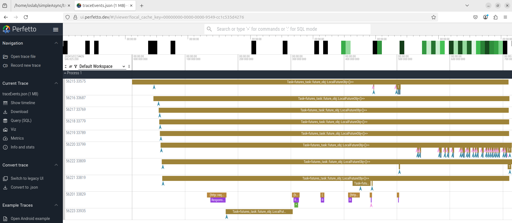

### 基于GDB的Rust异步函数调试方法

队员：曾小红，张弈帆，董嘉誉

北京工商大学计算机系

指导老师：吴竞邦

初赛文档PDF版[入口](https://github.com/Irissssaa/code-debug_Asynchronous-trace/blob/main/docs/Proj158_%E6%94%AF%E6%8C%81Rust%E8%AF%AD%E8%A8%80%E7%9A%84%E6%BA%90%E4%BB%A3%E7%A0%81%E7%BA%A7%E5%86%85%E6%A0%B8%E8%B0%83%E8%AF%95%E5%B7%A5%E5%85%B71.pdf)

### 目录
- [基于GDB的Rust异步函数调试方法](#基于GDB的Rust异步函数调试方法)
    - [摘要](#摘要)
    - [1 项目介绍](#1-项目介绍)
      - [1.1 项目背景及意义](#11-项目背景及意义)
      - [1.2 拟解决的关键问题](#12-拟解决的关键问题)
      - [1.3 项目目标](#13-项目目标)
    - [2 整体解决方案设计思路](#2-整体解决方案设计思路)
      - [2.1 现有研究调研概况](#21-现有研究调研概况)
      - [2.2 设计思路](#22-设计思路)
    - [3 核心模块实现与功能](#3-核心模块实现与功能)
      - [3.1 模块一：数据采集层实现](#31-模块一：数据采集层实现)
      - [3.2 模块二：数据处理层实现](#32-模块二：数据处理层实现)
      - [3.3 模块三：可视化展示层实现](#33-模块三：可视化展示层实现)
    - [4 功能评估与验证](#4-功能评估与验证)
    - [5 遇到的困难和解决办法](#5-遇到的困难和解决办法)

### 摘要

本项目以2025 OS竞赛为驱动，基于赛题 Proj 158 支持Rust语言的源代码级内核调试工具，针对Rust语言的异步函数调用跟踪与调试难以及已有方法通用性差的问题，设计基于GDB的白名单动态函数插桩跟踪与调试方法。我们旨在完成以下四个目标：

* 目标1：获取Rust异步代码与运行状态的对应关系；

* 目标2：获取Rust程序的Future依赖关系；

* 目标3：基于GDB实现支持白名单的异步函数跟踪框架；

* 目标4：Rust异步函数运行数据的可视化；

通过实现以上目标，能够解决当前Rust异步程序动态跟踪工具的普遍性问题。

### 1 项目介绍

本项目旨在为 Rust 异步编程提供一种创新的调试解决方案，解决现有工具在调试 Rust 异步代码时面临的诸多挑战。Rust 作为一门新兴的系统编程语言，以其安全性、高性能和并发能力在操作系统、嵌入式系统等领域崭露头角。然而，异步编程的复杂性，尤其是跨越用户态和内核态的调试需求，使得现有调试工具难以满足开发者的实际需求。本节将会详细介绍项目的背景、意义、目标以及核心创新点，为后续的解决方案设计和实现奠定基础。

#### 1.1 项目背景及意义

Rust 因其在安全性、并发性和性能方面的独特优势而备受关注，特别适用于开发需要高可靠性和高性能的系统，例如操作系统、嵌入式设备和网络服务。Rust 的异步编程支持是其并发能力的重要组成部分，允许开发者编写非阻塞代码，从而高效处理多任务场景。随着 Rust 在更复杂场景中的应用，尤其是在异步编程领域的深入发展，调试成为了一个亟待解决的问题。

##### 1.1.1 Rust非异步和异步函数调试概述

目前，针对非异步Rust函数调用的调试，调试器（如 GDB、LLDB）通过符号表（如 DWARF）映射到源代码行号进行断点设置、单步执行和变量检查。开发者可以在 VSCode、Eclipse 等主流 IDE 中使用这些调试器进行开发调试。

对于异步Rust程序的调试，异步Rust是一种有别于传统程序语言的创新模式。异步rust的协程切换完全使用同步函数实现，无需进行上下文切换。这导致异步rust函数的调用栈存储不在栈上而在堆上，且存储格式不固定，因此 Rust编译器使用的dwarf调试文件格式难以很好适应Rust语言中的异步函数调用形式。

##### 1.1.2 现有Rust异步调试工具概述

以下列举了我们已经掌握到的针对Rust异步程序的调试器或方法。

* [lilos](https://github.com/cbiffle/lilos) 是一个实验性质的异步 Rust 微内核操作系统，其配套调试器 lildb 通过 lilos 的运行时将异步任务状态信息主动暴露在一个预定义的固定内存地址区域，lildb 直接读取该内存区域来解析和展示任务状态。其要求被调试系统（lilos）本身进行专门设计以暴露状态。

* [tokio-console](https://github.com/tokio-rs/console) 作为 Tokio 运行时的调试插件，它通过一个独立的控制台连接来接收并可视化展示 Tokio 运行时内部的任务、资源（如锁）等状态信息。其特点是能提供丰富的运行时内部视图，但需要开发者使用特定的宏（如 #[tokio::main] 配合 console_subscriber）显式地注入跟踪代码到被调试程序中。

* [BugStalker](https://github.com/godzie44/bugstalker)该调试器通过直接读取和分析 Tokio 运行时内部管理异步任务的数据结构（如任务控制块）来获取任务状态和调用栈信息，但目前仅支持 Tokio 运行时。

* [CAT (Context Aware Tracing)](https://github.com/dsrhaslab/cat) 是一个软件框架，通过在 Rust 异步程序编译过程中自动插入探针，捕获异步操作的创建、调度、执行和完成事件，并关联其执行上下文，用于性能分析和调试。其特点是能自动跟踪异步行为上下文，但只能聚焦于用户态Rust异步程序性能诊断。

* [https://cubele.github.io/probe-docs/async-probe/](https://cubele.github.io/probe-docs/async-probe/) 该同学的工作是分析Rust异步程序编译后生成的dwarf调试信息，发现一个异步函数在dwarf调试信息里被表示为一个结构体, 且结构体内明确写出了这个异步函数对应的future会调用哪些future，但是用户自己实现的 future 并不会被记录在这些结构体里，因此作者建议先静态分析 dwarf 调试信息, 得到 future 依赖树再进一步分析，但是作者没有用代码完整实现这个思路, 原因是他使用的rust操作系统内没有 jprobe 插桩工具。

现有的 Rust 异步程序调试方案普遍存在通用性不足的问题，它们紧密绑定于特定的异步运行时（如 lildb 仅用于 lilos 自身的异步运行时，BugStalker/tokio-console 则是针对 Tokio）。像 lildb 和 tokio-console 都要求对被调试的代码本身进行修改（如暴露内存结构、添加特定宏）。

针对以上调试器的问题，我们项目旨在提出一种通用的Rust语言异步程序调试框架，可方便的适配不同的Rust运行时框架，不要求对被调试代码进行任何修改，支持不同特权级切换的协同调试。具体来说，本项目拟基于GDB实现一种基于白名单的函数插桩方法，实现不同Tracer的动态载入来对不同数据进行跟踪调试，如异步函数调用关系，函数参数、变量内容等。

#### 1.2 拟解决的关键问题

本项目拟解决的关键问题分析如下：

**（1）Rust语言的异步函数难以使用传统调试方法来跟踪**

Rust编译器使用的dwarf调试文件格式难以很好适应Rust语言中的异步函数调用形式。具体体现在如下两个问题：

**问题一：在Rust编译环境下，异步代码和运行状态之间的对应关系缺失**

异步代码和运行状态之间的对应关系缺失主要包括以下两个部分：

* 调试信息解析问题：由于rust采用的dwarf调试信息格式不支持异步函数，导致rust编译器在调试模式下编译生成的调试信息中缺少异步函数信息，使得传统调试方法无法调试rust异步程序。

* 运行时状态获取问题：rust官方提供的编译器没有提供统一的异步运行时，但是社区提供了很多第三方运行时，第三方运行时没有统一的状态暴露接口，导致没有一致的办法去获取运行时的状态。

**问题二：在Rust编译环境下，异步函数调用关系挖掘困难**

Dwarf调试信息中异步函数调用关系不直观，导致分析函数调用关系困难，需要通过特殊的字段来获得完整的异步函数调用关系。

**（2）Rust语言不提供官方运行时，适配的调试器存在通用性问题**

主要体现在：

**问题三：已有的Rust异步函数的调试方法都是针对特定的Rust操作系统或者运行时设计的，通用性低**

现有的Rust异步函数调试方案都是针对特定的操作系统或者运行时，例如只能在 lilos 上使用的 lildb 的异步调试工具，tokio-console 则只支持 Tokio 运行时，这种平台依赖性限制了调试工具的适用范围，增加了跨平台调试的复杂性。

**问题四：支持白名单的异步函数调试**

由于插桩影响运行效率，我们需要有动态调试的功能。通过对调试目标进行界定，来防止影响被调试系统的运行。


#### 1.3 项目目标

项目实现目标包括如下四个目标：

* 目标1：获取Rust异步代码与运行状态的对应关系

目标解读：根据Rust语言的异步特性，实现一个分析工具，针对Rust异步代码与运行状态对应关系，分析Dwarf调试信息。

* 目标2：获取Rust程序的Future依赖关系

目标解读：通过分析Dwarf信息中含有 _awaitee 和 member 标识符的字段，获取Rust异步程序 Future 依赖关系。

* 目标3：基于GDB实现支持白名单的异步函数跟踪框架

目标解读：基于GDB实现函数的插桩，具有良好的通用性，我们提供不同Tracer，通过动态载入，实现跟踪不同类型的数据。此外，我们还提供了一套基于eBPF+kprobe动态插桩内核态异步任务的框架。

* 目标4：Rust异步函数数据可视化

目标解读：将采集到的数据进行关键信息的提取，并按照火焰图的格式要求进行组织，然后使用相应的可视化工具获得Rust异步函数的火焰图。

| 目标 | 完成情况 | 说明                                                         |
| :--: | :------: | :----------------------------------------------------------- |
|  1   |   完成   | ✓ 实现 GDB Python 脚本插件加载机制<br />✓ 实现自动在函数进入和返回处打断点的插件<br />✓ 实现在断点触发后自动收集异步函数运行状态的插件<br />✓ 实现从异步函数名对应到 poll 函数的插件2完成 |
|  2   | 部分完成 | ✓ objdump 输出信息解析<br />[ ] 用 GDB 代替 objdump<br /> ✓ 构建异步函数依赖关系树<br />✓ 解析源代码中异步函数和符号表中poll函数的对应关系 |
|  3   |  未完成  | [ ] 实现异步程序跟踪框架（方便的异步运行时插桩，方便的异步运行时状态获取功能）<br />[ ] 实现tracer（函数参数、全局/本地变量，栈回溯获取等）<br />[ ] 内核态适配（拟embassy）<br />[ ] 用户态适配（tokio） |
|  4   |   完成   | ✓ 利用 GDB 插桩功能生成和绘制火焰图相关的事件<br />✓ Chrome Trace Event 格式 json 输出 |


### 2 整体解决方案设计思路

该部分首先围绕现有技术情况介绍展开，然后介绍项目的设计思路。

#### 2.1 现有研究调研概况

本小节主要介绍和Rust异步函数跟踪相关的技术和研究，并根据得到了调研结果和结论寻找本项目的相关切入点。

##### 2.1.1 Rust 异步概述

异步函数与同步函数的核心区别在于：异步函数可以在执行过程中被阻塞挂起，保持挂起时的上下文，并在之后恢复执行，而同步函数一旦开始执行就必须连续运行直至完成。Rust是通过 async/await 语法实现异步编程的，使用 async 关键字可以定义一个异步函数或代码块，它们返回一个实现了 Future trait 的对象，在异步函数内部，使用 .await 关键字可以暂停当前函数的执行，等待另一个 Future 完成而不阻塞线程。

 其他语言实现异步行为时，常见方案包括低效的主动轮询（浪费 CPU 资源）或依赖特定 CPU 指令集（ISA）的复杂栈切换，前者浪费CPU资源，后者牺牲了异步程序的可移植性。

相比之下，Rust的编译器将异步函数编译成一个 Future 状态机，该状态机在 .await 点处被分割成多个连续的、同步执行的代码片段；异步运行时负责在事件就绪时主动调用该 Future 的 poll 方法来驱动状态机推进，poll 方法根据内部状态执行对应的代码片段，并返回Poll::Ready（完成）或 Poll::Pending（需再次轮询）。

正是基于 Rust 异步函数最终被编译为可通过 poll 方法驱动执行的同步代码片段这一特性，我们的调试框架选择通过跟踪每个 Future 的 poll 函数来精准还原异步任务的执行流程。

##### 2.1.2 GDB 调试工具

GDB（GNU Debugger）是 Linux 生态中广泛使用的命令行调试工具，支持多语言程序（如 C/C++、Rust）的断点设置、变量检查、调用栈回溯等核心调试功能。其跨平台特性和可扩展架构使其成为底层系统开发的通用调试基础。

因为 GDB 的通用性和动态扩展能力，并且提供成熟的底层调试接口（如 Python API），所以我们拟基于 GDB 实现内核态和用户态异步函数的协同跟踪框架，通过 GDB 实现动态插桩，我们提供不同类型的Tracer，实现跟踪不同的数据类型。

##### 2.1.3 eBPF技术

	eBPF（Extended Berkeley Packet Filter）是一种在内核态运行的高效可编程技术，它允许用户在不修改内核代码的情况下，动态加载自定义程序到内核中执行[3]。这一特性使得 eBPF 在操作系统内核函数探测方面具有独特优势。	

利用 eBPF 的 kprobe 和 kretprobe 机制，我们能够在异步函数的入口和出口处插入精心编写的探测代码。当异步函数被调用时，这些探测代码会被触发，从而记录下丰富的信息。在本项目中，我们最初基于该机制实现了一套Rust操作系统异步任务跟踪的框架，但考虑到eBPF依赖于操作系统的支持，且该框架只能跟踪内核态，所以后续我们采用了更加通用的GDB作为框架基础。

##### 

#### 2.2 设计思路

该小节是我们根据现有的调试器工作以及支撑跟踪的相关技术设计的跟踪思路。

为实现目标，该项目设计三层协同架构（图2-1），通过数据采集、处理与可视化的分层协作，实现对异步函数的全生命周期追踪。


*图2.1  模块总体设计架构图*

##### 2.2.1 数据采集层

数据采集层采用静态分析技术，深入解析编译后的Rust二进制文件中的DWARF调试信息。最初我们使用objdump工具，通过正则表达式解析复杂的future结构体定义。核心设计在于通过模式匹配精准识别异步编程特征结构，包括async_fn_env、async_block_env等关键状态机标识，以及所有实现Future特性的类型。这种设计使系统能够不依赖源代码直接分析编译产物，为后续处理奠定坚实基础。在完成基础解析后，采集层通过递归分析结构体成员类型引用，构建出完整的Future依赖树，最终生成包含异步结构元数据的async.json和关键符号映射表future_map.json，形成静态分析的完整闭环。

但是由于该方式使用正则表达式解析objdump的输出内容可能会遗漏某些future的解析或将无关的结构体当作future。我们想到GDB中有专门解析dwarf信息的模块，解析会更加正确全面，所以我们最终决定用GDB代替objdump工具，对dwarf信息进行解析，获得异步程序中完整的future信息。通过分析GDB dwarf2模块获得的DIE信息内容，对其进行功能拓展，获取和future相关的信息，并将信息输出为.json文件。

##### 2.2.2 数据处理层

数据处理层构建在GDB调试框架之上，实现运行时异步行为的动态追踪。该层通过加载采集层生成的future_map.json符号映射表，智能定位所有Future的poll函数位置并设置精确断点。核心创新在于实现非侵入式的双阶段监控机制：当执行流进入poll函数时，系统记录带有时间戳的"B"（开始）事件；当退出poll函数时，则生成对应的"E"（结束）事件。所有事件数据均采用标准化的Chrome Tracing格式记录，包含线程ID、Future名称等关键上下文信息。这种设计确保较小性能开销下，完整捕获异步任务的调度、执行和状态转换过程，形成高保真的运行时轨迹。

我们最开始是基于 eBPF+kprobe 技术实现的数据处理，原因是最初我们的目标是针对Rust操作系统异步任务的跟踪，未考虑用户态异步函数的跟踪，但是后续我们发现基于GDB实现异步跟踪可以实现不同特权级的协同跟踪，且通用性更好，而eBPF方式则依赖于操作系统对该技术的实现，所以我们的Rust异步跟踪最新方案选择基于GDB实现。

##### 2.2.3 可视化层

可视化层采用双模态展示策略，同时呈现静态结构和动态行为。对于静态依赖关系，系统通过visualize_deps.py将采集层生成的依赖树转换为DOT格式图形，利用Graphviz生成交互式拓扑图，开发者可通过节点标签直接定位到源码位置。对于运行时行为，则采用时间维度展示，将数据处理层输出的traceEvents.json导入Chrome浏览器的tracing工具中，生成带时间刻度的火焰图。这种双视角可视化设计使开发者既能观察异步组件的静态组织关系，又能分析其动态执行特征，形成对异步代码执行模式的立体认知。

### 3 核心模块实现与功能

为了方便地适配不同的异步运行时，本项目将数据采集、数据处理与最终的可视化展示分离成一个三层体系结构（如 embassy、async-std）。本章将详细阐述各模块的设计细节。【组会纪要再搬一点过来】

#### 3.1 模块一：数据采集层实现

数据采集层通过 GDB 的插桩能力，在程序运行时动态、无侵入地获取异步函数运行状态。该层围绕 GDB Python API，构建了一套可扩展的插件系统，进而实现各种异步信息的收集插件。

##### 3.1.1 基于 GDB Python 脚本的插件加载机制 

由于 GDB Python API 的限制，GDB 无法直接加载文件夹项目，只能利用  `source` 命令一次加载一个 Pytho。 文件，这对我们实现插件系统造，了不便。因为从使用者的角度，将插件作为独立的文件放入本项目的文件夹是远比直接修改源代码方便的。因此我们让 GDB 加载整个工具的入口  `gdb_debugger/main.py`，由它利用python的 `import_module` API 插件加时插件。

```python
# gdb_debugger/main.py
# ..允许用户通过环境变量 GDB_DEBUGGER_PLUGIN 指定要加载的运行时插件加载插件
PLUGIN_NAME = os.getenv("GDB_DEBUGGER_PLUGIN", "tokio")
try:
    plugin_mod=importlib.import_module(f"gdb_debugger.runtime_plugins.{PLUGIN_NAME}")
    plugin = plugin_mod.plugin
    print(f"[gdb_debugger] Loaded runtime plugin: {plugin.name}")
except (ImportError, AttributeError) as e:
```
##### 3.1.2 基于 GDB 的函数插桩

为了收集目标程序在运行过程中产生的状态信息，我们利用 GDB 的断点机制来构建插桩点。这种插桩方法无需重新编译目标程序，因此具有较高的灵活性。

考虑到用户有性能分析检测的需求，该插件不仅需要在函数入口处设断点，更需要在函数返回处设断点，这样才能分析出异步函数的运行时间。然而，GDB设置函数返回处断点的API  `FinishBreakpoint` 只能在函数进入处断点 `FunctionBreakpoint` 触发后才能设置（因为 `FinishBreakpoint` 是基于栈帧实现的，函数的栈帧在函数入口断点触发之后才会出现）。为了解决这个问题，我们设计了一个两阶段断点机制： `EntryBreakpoint` 类首先在函数的入口地址设置一个断点。当此断点命中时，GDB调用插桩代码完成数据采集，然后设置该函数栈帧返回的断点。

```python
# gdb_debugger/main.py
class EntryBreakpoint(gdb.Breakpoint):
    # ...
    def stop(self):
    # 创建一个临时断点，并为其绑定一个 Python 命令。GDB 会继续执行，立即命中这个临时断点，此时函数的 prolog 已执行完毕，所有参数都已在栈或寄存器中准备就绪
        pc = gdb.selected_frame().pc()
        t_break = gdb.Breakpoint(f"*{pc}", gdb.BP_BREAKPOINT, internal=True, temporary=True)

        # 绑定一个 Python 函数到临时断点的命令列表
        cmd_index = len(bp_commands)
        bp_commands.append(lambda: run_tracers(self.symbol_name, self.entry_tracers, self.exit_tracers))

        # GDB 会在命中临时断点时执行 python 命令，然后自动 continue
        t_break.commands = f"""python bp_commands[{cmd_index}]()continue"""
        return False # 继续执行，以命中临时断点
```
一个值得注意的细节是，由于 GDB Python API 的限制，在断点触发后，被调试程序继续执行前，用于执行插桩代码的`gdb.execute` API只能执行一次，如果多次调用的话第一次之后的调用都是无效的，因此插桩代码需要利用`break...commands...end` 语法合并到一个字符串内统一执行。
##### 3.1.3 追踪器（Tracer）插件

有了基于 GDB 的插桩框架后，我们引入了追踪器（Tracer）的概念，使用户可以方便地定义在插桩点需要采集的数据。

一个 Tracer 是一个专门负责采集特定信息的 Python 类。例如，VariableTracer 用于读取某个变量，BacktraceTracer 用于获取当前调用栈，而 TokioTaskIDTracer 则是为解析 Tokio 任务ID 而设计的专用追踪器。用户在编写运行时插件时，其核心任务就是为每个插桩点定义一个 entry_tracers 列表和一个 exit_tracers 列表。


当一个插桩点（即断点）被命中时，run_tracers 函数会被调用，它负责遍历该插桩点定义的所有 tracer，创建实例，运行它，并将其采集到的数据存入一个全局的 traced_data 字典中。我们希望通过这种设计，将“何时”采集（由 main.py 的断点机制决定）和“采集什么”（由插件的 Tracer 定义决定）清晰地分离开来，从而提升本工具的模块化程度和可扩展性。


下面是 tokio 插件中一个插桩点的例子：

```python
// gdb_debugger/runtime_plugins/tokio.py
// ... existing code ...
    def instrument_points(self):
        return [
            {
                "symbol": "tokio::runtime::task::core::Core<S, T>::poll",
                "entry_tracers": [
                    tracers.Variable.factory("self.header.id.as_u64()","task_id"),],
                "exit_tracers": [],
            },
// ... existing code ...
```
当 `tokio::runtime::task::core::Core<S, T>::poll` 函数被命中断点时,`run_tracers` 函数会被调用，并负责执行该插桩点定义的所有 tracer。
```python
# gdb_debugger/main.py
# run_tracers 函数会遍历  entry_tracers 列表，对每个  tracer factory 函数，创建 tracer 实例，运行它，并将其采集到的数据存入一个全局的  traced_data 字典中
def run_tracers(symbol_name, entry_tracers, exit_tracers):
    # ...
    # 为本次函数调用创建一个记录
    invocation_data = {
        "thread_id": thread.ptid,
        "entry_tracers": {},
        "exit_tracers": {},
    }
    traced_data[symbol_name].append(invocation_data)

    # 运行所有入口追踪器
    for tracer_factory in entry_tracers:
        tracer = tracer_factory()
        tracer.start(thread)
        invocation_data["entry_tracers"][str(tracer)] = tracer.read_data()
    # 如果有出口追踪器，则设置一个函数返回断点
    if exit_tracers:
        FinishBreakpoint(gdb.newest_frame(), symbol_name, invocation_data, exit_tracers)
```

##### 3.1.4 异步函数名映射到 poll 函数的关键信息收集

从Dwarf调试信息中提取出异步状态机信息，我们采用了两种方式实现：基于objdump工具分析调试信息；基于GDB dwarf解析模块实现异步状态机的信息提取；前者已经完全实现，后者部分完成。两种方式的设计思路来源已在 2.2 节进行了阐述，以下是两者实现方式的具体阐述（基于GDB实现的异步状态机的信息提取是本模块的重点，所以我们将其作为3.1.5小节进行展示）。

- **基于objdump工具分析调试信息（Dwarf Analyzer）**

DWARF Analyzer 使用 DWARF 调试信息从已编译的 Rust 二进制文件中提取异步状态机信息。它无需运行时执行即可识别异步函数环境、未来状态机及其依赖项。该分析器能够理解异步代码结构，并生成动态分析工具使用的映射。

该模块的核心类 DwarfAnalyzer 是 DWARF 调试信息处理的主要接口。


*图3.1 DwarfAnalyzer类*

该模块处理DWARF信息的流程如下：

1. 第一阶段：DWARF 信息提取

分析器首先使用 `objdump --dwarf=info` 命令从二进制文件中提取 DWARF 调试信息 。

```typescript
42  def run_objdump(self) -> str:
43        """Run objdump and return its output."""
44        result = subprocess.run(['objdump', '--dwarf=info', self.binary_path], 
45                              capture_output=True, text=True)
46        return result.stdout
```
2. 第二阶段：文件表解析

在每个编译单元中，分析器解析文件表以建立文件索引到文件路径的映射关系 。这个阶段提取编译目录和源文件路径信息。

```typescript
    def _parse_file_table(self, comp_unit_lines):
90        """
91        Parses the file table from a DWARF compilation unit.
92        The file table is a list of file entries that follow the main CU attributes.
93        """
94        comp_dir = ""
95        # First, find the compilation directory.
96        for line in comp_unit_lines:
97            if 'DW_AT_comp_dir' in line:
98                match = re.search(r'DW_AT_comp_dir\s*:\s*(?:\(indirect string, offset: 0x[0-9a-f]+\):\s*)?(.+)', line)
99                if match:
100                    comp_dir = match.group(1).strip().strip('"') # Remove quotes if present
101                    break
102        
103        # Now find file entries. In objdump output, these appear sequentially
104        # and are not always explicitly tagged with DW_TAG_file_type on the same line.
105        # This is a robust heuristic that assumes the file list starts after the main CU attributes.
106        file_index = 1
107        found_main_cu_name = False
108        for line in comp_unit_lines:
109            if 'DW_AT_name' in line:
110                match = re.search(r'DW_AT_name\s*:\s*(?:\(indirect string, offset: 0x[0-9a-f]+\):\s*)?(.+)', line)
111                if match:
112                    name = match.group(1).strip()
113                    if not found_main_cu_name:
114                        # The first name is the compilation unit itself, skip it.
115                        found_main_cu_name = True
116                        continue
117                    
118                    # Subsequent names are file paths.
119                    # This logic assumes they appear in order of their index.
120                    full_path = os.path.join(comp_dir, name) if comp_dir and not os.path.isabs(name) else name
121                    self.file_table[str(file_index)] = full_path
122                    file_index += 1
123
```
3. 第三阶段：结构体识别与解析

分析器通过正则表达式匹配识别 `DW_TAG_structure_type` 条目，并解析每个结构体的详细信息 。在这个阶段，分析器会：

* 识别异步函数环境：通过匹配 `async_fn_env|async_block_env` 模式 

* 识别状态机：通过匹配 `Future|future` 模式或已标识的异步函数

* 解析结构体成员信息，包括名称、类型、偏移量等 

```typescript
68# Detect the beginning of a structure DIE – rely on depth value instead of spaces
69            m = re.match(r'\s*<(\d+)><[0-9a-f]+>: Abbrev Number: .*?\(DW_TAG_structure_type\)', line)
70            if m:
71                struct_depth = int(m.group(1))
72                struct_lines = [line]
73                i += 1
74                # Collect every subsequent line **until** we meet another DIE header ("Abbrev Number:")
75                # whose depth is **less than or equal** to the current struct's depth.
76                while i < len(lines):
77                    l = lines[i]
78                    m2 = re.match(r'\s*<(\d+)><[0-9a-f]+>: Abbrev Number:', l)
79                    if m2:
80                        depth = int(m2.group(1))
81                        if depth <= struct_depth:
82                            break
83                    struct_lines.append(l)
84                    i += 1
85                self._parse_struct_block(struct_lines)
86                continue
87            i += 1
```
4. 第四阶段：依赖关系构建

分析器构建 Future 依赖树，通过递归分析状态机结构体的成员类型来发现依赖关系。这个过程使用 `_resolve_deps_recursive` 方法来避免循环依赖。

5. 第五阶段：符号映射

通过 `export_map.py` 模块，分析器将 Future 类型映射到其对应的 poll 函数符号 。这个阶段包括：

* 提取符号表

* 使用 `rustfilt` 进行符号反混淆

* 匹配 Future 类型与其 poll 函数

6. 第六阶段：结果输出

最终，分析器将分析结果输出为结构化的 JSON 格式，包含异步函数、状态机和依赖树信息。

```python
    def output_json(self):
349        analysis = self.analyze_futures()
350        dep_tree = self.build_dependency_tree()
351        def struct_to_dict(struct):
352            locations = []
353            for member in struct.members:
354                if member.decl_file and member.decl_line:
355                    locations.append({'file': member.decl_file, 'line': member.decl_line})
356            
357            return {
358                'name': struct.name,
359                'size': struct.size,
360                'alignment': struct.alignment,
361                'is_async_fn': struct.is_async_fn,
362                'state_machine': struct.state_machine,
363                'locations': locations,
364                'members': [
365                    {
366                        'name': m.name,
367                        'type': m.type,
368                        'offset': m.offset,
369                        'size': m.size,
370                        'alignment': m.alignment,
371                        'is_artificial': m.is_artificial,
372                        'decl_file': m.decl_file,
373                        'decl_line': m.decl_line
374                    } for m in struct.members
375                ],
376                'type_id': struct.type_id
377            }
378        out = {
379            'async_functions': [struct_to_dict(s) for s in analysis['async_functions'].values()],
380            'state_machines': [struct_to_dict(s) for s in analysis['state_machines'].values()],
381            'dependency_tree': dep_tree
382        }
383        print(json.dumps(out, indent=2, ensure_ascii=False)
```
##### 3.1.5 基于GDB dwarf解析模块实现异步状态机的信息提取

该方式基于GDB dwarf调试信息解析模块，使用与第一种方式相同的分析思路，来获得完整的 future 相关信息。主要实现的代码放在了GDB/gdb/dwarf2下，分别是rust- future.h和rust-future.c。

1. 关键类的实现

* rust_future_member类 表示最小单位的 future 成员，包含成员名称、类型ID、状态机标识、偏移量和大小等元数据，其中 is_state_machine 标志用于识别嵌套状态机。

```c
struct rust_future_member // Rust Future结构体中的单个成员
{
    /* Member name */
    const char *name;

    /* Type ID of the member */
    sect_offset type_id;
  
    /* Whether this member is a state machine */
    bool is_state_machine;
  
    /* Offset of the member in the struct */
    ULONGEST offset;
    /* Size of the member */
    ULONGEST size;
};
```
* rust_future_info 类 表示基本单位的 future 结构体，记录结构体名称和是否为状态机的标志，并且存储了所有的 子future 成员。

```c
struct rust_future_info // 一个完整的Rust Future结构体
{
    /* Name of the Future struct */
    const char *name;

    /* Whether this is a state machine */
    bool is_state_machine;

    /* List of members */
    std::vector<rust_future_member> members;

    /* Dependencies on other Futures */
    std::vector<const char *> dependencies;
};
```
* rust_future_collection类 表示程序中所有的future结构体，这里我们使用哈希表实现名称到Future信息的快速查找，建立了类型ID到结构名的映射关系，支持跨编译单元的类型解析。

```c
struct rust_future_collection // 存储所有Rust Future信息
{
    /* Map of struct names to their Future info */
    std::unordered_map<std::string, rust_future_info> futures;

    /* Map of type IDs to struct names */
    std::unordered_map<sect_offset, std::string> type_id_to_struct;
};
```
通过这三个类的实现，能够完整记录下Dwarf调试信息中和future相关的DIE内容，包括future之间的依赖关系。

2. 核心功能实现

rust-future.c中各函数的关系示意图如下：


*图3.2 rust-future.c各函数的关系*

该模块我们采用以下处理流程来分析和提取Future信息：

1. 初始化阶段：通过_initialize_rust_future()注册GDB命令，建立调试输出通道；

2. 扫描阶段：遍历所有编译单元(CU)，识别包含Future信息的DWARF条目；

3. 解析阶段：深度分析每个Future结构体的成员和类型信息；

4. 依赖分析阶段：构建Future间的依赖关系图；

5. 输出阶段：生成结构化的JSON文档；

具体的函数实现如下：

我们期望在GDB中使用analyze-rust-futures命令，输出我们所需要的future依赖关系json文件，通过_initialize_rust_future ()将命令注册到GDB中，具体代码实现如下：

```typescript
void
_initialize_rust_future ()
{
    /* Write to a file to confirm function is called */
    FILE *debug_file = fopen("/tmp/rust_future_init_debug.txt", "w");
    if (debug_file != nullptr)
    {
        fprintf(debug_file, "Rust Future initialization function called!\n");
        fclose(debug_file);
    }

    /* Try to use gdb_printf, but it might not work during early initialization */
    try
    {
        gdb_printf (_("Initializing Rust Future processing...\n"));
    }
    catch (...)
    {
        /* Ignore any exceptions during early initialization */
    }

    /* Simple command registration - this should work if maintenancelist is ready */
    struct cmd_list_element *cmd = add_cmd ("analyze-rust-futures", class_maintenance,analyze_rust_futures, _("Analyze Rust Futures in the current program and generate JSON output."), &maintenancelist);
```
而该命令对应的函数 analyze_rust_futures 具体实现如下：
```typescript
void
analyze_rust_futures (const char *args, int from_tty)
{
    /* Check if we have any objfiles loaded */
    if (current_program_space == nullptr)
    {
        warning (_("No program loaded. Please load a program first."));
        return;
    }

    /* Check if there are any objfiles by checking the iterator */
    bool has_objfiles = current_program_space->objfiles().begin() != current_program_space->objfiles().end();

    if (!has_objfiles)
    {
        warning (_("No object files loaded. Please load a program with debug information."));
        return;
    }

    int cu_count = 0;
    int analyzed_count = 0;
    for (objfile *objfile : current_program_space->objfiles ())
    {
        if (objfile == nullptr || objfile->sf == nullptr)
            continue;
        dwarf2_per_objfile *per_objfile = get_dwarf2_per_objfile (objfile);
        if (per_objfile == nullptr)
            continue;
        // Aging old units if needed
        per_objfile->age_comp_units();

        // Correctly iterate over all loaded compilation units (CUs)
        for (dwarf2_per_cu_data *per_cu : per_objfile->get_all_per_cus())
        {
            dwarf2_cu *cu = per_objfile->get_cu(per_cu);
            if (cu == nullptr || cu->dies == nullptr)
                continue;
            ++cu_count;
            try
            {
                process_rust_futures(cu);
                ++analyzed_count;
            }
            catch (const std::exception &e)
            {
                warning(_("Error analyzing CU for Rust Futures: %s"), e.what());
            }
        }
    }
    gdb_printf (_("Rust Future analysis complete.\n" "Total compilation units scanned: %d\n"
"Successfully analyzed units: %d\n"),cu_count, analyzed_count);
}
```
该函数的实现还依赖于其他重要的函数方法，具体来说，通过is_rust_future (struct die_info *die) 和 is_state_machine (struct die_info *die) 判断DIE结构体是否是future状态机。两个函数都首先检查DW_TAG_structure_type，因为Rust的Future和状态机都是用结构体实现的。
```typescript
static bool
is_rust_future (struct die_info *die)
{
    if (die->tag != DW_TAG_structure_type)
        return false;
    struct attribute *name_attr = die->attr (DW_AT_name);
    if (name_attr == NULL)
        return false;
    const char *name = name_attr->as_string ();
    return (strstr (name, "Future") != NULL ||
            strstr (name, "future") != NULL);
}

/* Check if a DIE represents a state machine */
static bool
is_state_machine (struct die_info *die)
{
    if (die->tag != DW_TAG_structure_type)
        return false;
    struct attribute *name_attr = die->attr (DW_AT_name);
    if (name_attr == NULL)
        return false;
    const char *name = name_attr->as_string ();
    return (strstr (name, "State") != NULL || 
            strstr (name, "state") != NULL);
}
```
parse_rust_future (struct die_info *die, struct rust_future_collection *collection)函数通过上面两个方法筛选出future结构体，然后对future结构体中的子future进行解析，从而获得最后的rust_future_collection 类，函数中将DIE的段偏移(sect_off)映射到结构体名称，这是后续解析依赖关系的关键，具体实现代码如下：
```typescript
static void
parse_rust_future (struct die_info *die, struct rust_future_collection *collection)
{
    if (!is_rust_future (die))
        return;
    struct attribute *name_attr = die->attr (DW_AT_name);
    if (name_attr == NULL)
        return;
    const char *name = name_attr->as_string ();
    struct rust_future_info future_info;
    future_info.name = name;
    future_info.is_state_machine = is_state_machine (die);
    future_info.members.clear ();
    future_info.dependencies.clear ();

    /* Store type ID mapping */
    collection->type_id_to_struct[die->sect_off] = name;
    
    /* Parse members */
    struct die_info *child = die->child;
    while (child != NULL)
    {
        if (child->tag == DW_TAG_member)
        {
            struct rust_future_member member;
            struct attribute *member_name = child->attr (DW_AT_name);
            struct attribute *member_type = child->attr (DW_AT_type);
            struct attribute *member_offset = child->attr (DW_AT_data_member_location);
            struct attribute *member_size = child->attr (DW_AT_byte_size);
            if (member_name != NULL && member_type != NULL)
            {
                member.name = member_name->as_string ();
                member.type_id = (sect_offset) member_type->as_unsigned ();
                member.is_state_machine = false;  // Will be updated when processing the type
                member.offset = member_offset ? member_offset->as_unsigned () : 0;
                member.size = member_size ? member_size->as_unsigned () : 0;
                
                future_info.members.push_back (member);
            }
        }
        child = child->sibling;
    }

    collection->futures[name] = future_info;
}
```
然后使用resolve_deps_recursive函数和export_future_info_to_json函数递归构建函数依赖关系，并将其以json文件的格式输出。目前该方式的功能还未完全实现，后续模块的工作都是基于objdump工具输出的future依赖关系文件进行展开的。
#### 3.2 模块二：数据处理层实现

数据处理层的核心任务是将数据采集层收集到的、以函数调用事件为单位的 traced_data，转化为结构化、有意义的异步运行时状态模型。原始数据仅仅是“在某个时间点，某个线程上的某个函数被调用了，其参数值为...”这样的离散信息。我们需要将这些碎片化的信息关联、聚合起来，形成一个能够反映任务创建、执行和销毁完整周期的模型，从而为用户提供“任务A唤醒了任务B”、“Future C的执行包含了Future D和Future E”这样更有价值的信息。

DWARF Analyzer 生成的 `future_map.json` 文件被 GDB Profiler 使用，提供了将 Future 类型映射到 poll 函数符号的关键信息， GDB Profiler 使用这些映射在正确的函数上设置断点。

GDB Profiler 模块通过使用 GDB Python 脚本检测运行时函数，动态分析 Rust 异步代码，可以捕获实时执行轨迹、任务生命周期事件和运行时行为数据，以补充 DWARF Analyzer 执行的静态分析。

该模块由三个主要层组成：管理断点和数据收集的主 GDB 脚本、定义检测点的运行时特定插件以及从执行上下文中提取特定数据类型的Tracer。

##### 3.2.1 断点实现细节

为了在不中断程序正常流程的情况下，精确地在函数入口和出口捕获所需数据，我们设计了一套精巧的两阶段断点系统。该系统由 gdb_debugger/main.py 中的几个核心类和函数协同工作，以解决在函数 prolog（序言）完成前无法安全访问函数参数的难题。

|内容|作用|关键方法|
|:----|:----|:----|
|EntryBreakpoint|初始函数入口检测|stop()- 创建临时断点|
|FinishBreakpoint|函数退出监控|stop()- 运行退出跟踪器，out_of_scope()- 处理异常|
|run_tracers()|协调追踪器执行|管理进入/退出追踪器生命周期|
|bp_commands|命令存储|存储断点命令的 Python 可调用全局列表|

##### 3.2.2 运行时特定插件

我们的GDB Profiler 定义的运行时插件提供了一个可扩展的架构，用于在 GDB 分析器系统中检测不同的异步运行时框架。它们定义了要检测哪些运行时函数、在这些点收集哪些数据以及如何处理收集到的跟踪数据。该插件系统支持针对特定的异步运行时行为进行有针对性的分析，而无需修改核心 GDB 调试基础架构。运行时插件系统使用一个抽象基类来定义一个通用接口，所有特定于运行时的插件都必须实现该接口。这种设计允许 GDB 分析器通过统一的插件加载机制与不同的异步运行时协同工作。

基于`RuntimePlugin`类定义了所有插件实现必须提供的三个抽象方法：

|方法|作用|返回类型|
|:----|:----|:----|
|name()|识别运行时框架|str|
|instrument_points()|定义断点位置和跟踪器|list[dict]|
|process_data()|处理收集的跟踪数据|void|

tokio_model.py 文件中定义了两个核心类： `Task` 和  `Runtime`。 `Task` 类代表一个独立的异步任务，它记录了该任务的所有关键属性：

* id: 任务的唯一标识符。

* poll_count: 任务被轮询的总次数。

* spawn_location: 根据创建时的栈回溯信息推断出的任务生成位置。

* created_at / dropped_at: 任务创建和销毁的时间戳，用于计算其生命周期。

 `Runtime` 类则作为整个异步运行时状态的容器，它包含一个从 task_id 到 Task 对象的字典，以及一个记录每个线程最后一次捕获到的 TaskList 的字典，为 inspect-async 命令提供数据源。

```python
# gdb_debugger/runtime_plugins/tokio_model.py
import datetime
class Task:
    """Represents a single Tokio task and its collected metrics."""
    def __init__(self, task_id, backtrace=None):
        self.id = task_id
        self.pointers = set()
        self.poll_count = 0
        self.created_at = datetime.datetime.now()
        self.dropped_at = None
        self.spawn_location = self._extract_spawn_location(backtrace)
        # ... 其他方法 ...
class Runtime:
    """Represents the state of the Tokio runtime and all its tasks."""
    def __init__(self):
        self.tasks = {} # Dict of task_id -> Task
        self.thread_task_lists = {} # Dict of thread_id -> last known OwnedTasks gdb.Value
        # ... 其他方法 ...
```
##### 3.2.3 多种Tracer

Tracer 提供数据收集机制，用于在 GDB 调试会话期间捕获运行时信息。它负责在异步执行分析期间从下级进程中提取变量值、调用堆栈和其他运行时状态。该工具使 GDB Profiler 能够收集多种的异步函数执行数据，以便后续进行可视化和分析。

所有跟踪器都实现了由基类定义的通用接口`Tracer`。这为 GDB 分析器提供了一致的 API，以便与不同类型的数据收集器进行交互。


​																											图3.3 Tracer类

GDB Profiler输出Rust异步运行时执行轨迹到 traceEvents.json 中，提供给可视化层。

```typescript
{"traceEvents": [ {"ph": "B", 
                    "name": "async_main::{{closure}}", 
                    "ts": 100261253, 
                    "tid": 1073,
                    "args": {"depth": 0, "Function address": "0x55a3980a21b5"} }, 
                  { "ph": "E", "name": "async_main::{{closure}}", "ts": 100261253, "tid": 1073, "dur": 1751, "args": {"depth": 0, "Function address": "0x55a3980a21b5"} } ],
"displayTimeUnit": "microseconds" }
```


#### 3.3 模块三：可视化展示层实现

可视化展示层的目标是将数据处理层生成的结构化数据，以直观、易于理解的形式呈现给开发者，帮助其快速定位问题。我们先说明为了可视化展示收集了哪些信息，再说明针对不同的分析场景，我们实现的多种可视化方案。

##### 3.3.1 利用 GDB 插桩功能生成和绘制火焰图相关的事件

在 `process_data`方法的最后阶段，我们会遍历重构好的异步函数调用关系图，为每一次 poll 函数的执行生成一个JSON对象，格式如下：

```json
{
    "name": "async_task_1",
    "cat": "async",
    "ph": "X",
    "ts": 1234567.890,
    "dur": 150.321,
    "pid": 1,
    "tid": 1234,
    "args": { "task_id": 42 }
}
```
* name: 异步函数名。

* ph: "X"，表示一个完整的事件，拥有开始时间和持续时间。

* ts: timestamp，事件开始的时间戳（单位：微秒）。

* dur: duration，事件持续时间（单位：微秒）。

* tid: thread_id，执行该任务的线程ID。

##### 3.3.1 Chrome Trace Event 格式 json 输出

火焰图常用于分析任务调度、并发问题以及执行延迟等行为。我们选择生成 Chrome Trace Event 格式的 JSON 文件，再将它导入到 chrome://tracing 和 Perfetto 等工具中。与传统的基于同步函数调用栈生成的火焰图不同，我们的 gdb_profiler/async_flame_gdb.py 脚本专门为异步程序设计。它并不关心完整的、混杂了运行时内部函数的系统调用栈，而是只包含异步函数函数调用关系和调用时间。

例如，将数据处理好的json文件导入chrome//tracing，会生成如3.8所示火焰图。这种“异步火焰图”能够精确地展示出在整个程序运行期间，各个异步函数的执行时间占比，让开发者可以一眼看出哪个 async fn 是“热点”，从而进行针对性优化。

在生成火焰图时，将时间戳作为 x 轴的刻度，函数调用栈作为 y 轴的层次结构，函数执行时间通过火焰图的宽度来表示。通过调整火焰图的参数，如颜色、透明度等，使其更加直观和易于理解。生成的火焰图可以通过浏览器等工具进行查看和交互，用户可以通过缩放、点击等操作深入了解异步函数的调用细节。具体意义如下：


 

​																										图3.4 火焰图示例

 

横轴（时间轴）：单位为微秒，展示异步函数的执行时间跨度。每个函数调用表现为水平矩形条，长度对应 dur 值，越宽表示执行时间越长。

	纵轴（调用栈层次）：从下到上表示调用嵌套关系，顶层为根任务（如 async_std::task::poll），下层为子 Future 或闭包。同一层级的函数按调用顺序排列，反映异步任务的调度顺序。
	
	颜色与标记：不同颜色区分不同类型的异步函数。
	
	用户可以通过以下方式进行交互式分析：
	
	缩放与平移：通过鼠标滚轮或界面按钮调整时间轴粒度，查看局部细节或全局流程。
	
	点击查询：点击矩形条下方显示详细信息，包括函数名、执行时间、线程 ID、调用栈深度及原始地址（用于匿名符号调试）。
	
	总执行时间：界面顶部显示整个追踪区间的时间跨度。

热点函数：通过矩形条宽度直观识别耗时最长的函数以便用户对函数性能进行评估，从而进行优化。

##### 3.3.2 GraphViz 格式异步函数依赖图

在理解复杂异步代码的结构时，一个静态的函数调用关系图非常有帮助。dwarf_analyzer 模块在分析 DWARF 信息时，不仅提取了 async fn -> poll 的映射，还分析出了 Future 之间的静态包含关系（即一个 async fn 的函数体内 await 了哪些其他的 async fn）。

我们将这种静态依赖关系输出为 Graphviz 的 .dot 格式文件。.dot 是纯文本格式：

```plain
digraph G {
"complex_future_test::main" -> "complex_future_test::async_task_1";
"complex_future_test::main" -> "complex_future_test::async_task_2";
}
```
这个 .dot 文件可以使用  `dot` 命令行工具生成一张清晰的依赖关系图。这就是立项初期我们提到的“调用关系树形图”的简单实现。它有助于开发者理解异步代码的组织结构。
除了 `dot` 工具外，用户也可以使用 `xdot` 工具进行交互式查看。下图是由 dwarf_analyzer 生成的异步函数静态依赖图。箭头表示 await 关系，例如 main 函数 await 了 async_task_1 和 async_task_2。


*图3.5  async_task_1 和 async_task_2*


### 4 功能评估与验证

针对最新设计方案（基于GDB打断点进行动态插桩跟踪异步函数）我们的初步验证结果如下：

用户态：tokio


*图4.1 用户态tokio运行时结果*

内核态：rCore-Tutorial-v3


*图4.2 内核态 rcore 测试结果*

GDB插桩+绘制异步函数火焰图功能：


*图4.3 火焰图*

更严格的评估与验证决赛再进行补充。

对于我们开发过程中，实现的其他相关方案的结果展示如下：

基于eBPF+kprobe技术实现异步函数跟踪：	运行 zCore 操作系统，并加载 eBPF 程序。通过模拟异步函数的调用场景，测试 eBPF 程序是否能够准确探测到函数的进入和退出事件。

经过测试，eBPF 程序能够成功探测到异步函数的kprobe和kretprobe事件，并正确记录事件类型、函数地址、线程 ID 等信息。通过查看 eBPF 输出的日志文件，验证了数据采集的准确性。如图4.4，在日志文件（async.log)中可以清晰看到函数进入和退出时记录的信息,此为原始数据，通过python脚本将日志输出转换为规范的json格式，得到图4.5，成功完成数据处理。
	

*4.4 log 文件内容*


*图4.5 json 格式的输出*

该方法的可视化界面结果和分析：

通过可视化界面展示异步函数的调用情况，不同颜色矩形条代表不同函数调用，其长度反映函数执行持续时间，位置对应执行时间点。如图4.6可清晰看到函数执行的先后顺序和时间跨度。点击不同的颜色条可以看到不同的函数信息，移动时间轴，可以看到整个过程的异步信息。不一样的颜色代表不同类型的异步函数，从上到下依次为异步函数的嵌套逻辑，从左到右为执行时间。

例如，图中4.7中`<core::future::from_generator::GenFuture<...>::poll`函数，其矩形条在时间轴上占据一定时长，表明执行有一定耗时。结合详细信息面板，该函数开始时间为 00:39:12.508 200 000 ，持续时间 1s 694ms 700us 。从线程和进程信息（线程 1073 [27883] 、进程 1073 [27877] ）可知其执行环境。

这种可视化呈现方式，能直观展现异步函数调用流程，帮助开发者快速定位执行耗时较长的函数，识别可能影响系统性能的关键函数节点。


*图4.6 	可视化火焰图1*


*图4.7  可视化火焰图2*

### 5 遇到的困难和解决办法

最初我们的Rust异步跟踪方案基于 1.1.2 的工作5，考虑到zCore Rust 内核缺少像 uftrace （用于用户态函数追踪与数据采集）这样现成的工具链，于是找到替代方案：采用 eBPF 结合 kprobe 的方式实现内核态异步函数追踪。Kprobe可以在函数的出入口处注册并关联相应操作，ebpf允许用户在不修改内核代码的情况下，动态加载自定义程序到内核中执行。于是可以将ebpf程序关联到注册的kprobe出入口，当函数执行到这些探测点时，eBPF 程序将被触发，从而记录下关键信息，包括但不限于时间戳、线程 ID、函数地址、调用栈深度等，实现数据采集。

但是该跟踪方式只能跟踪内核态的异步任务，并且eBPF依赖于内核的支持，这使得该跟踪框架有极大的局限性。后来，我们想到了使用 GDB 这个更通用的调试器作为框架基础，才有了现在的Rust异步跟踪实现方案。

另外，针对问题二，异步函数调用关系的缺失，我们最初参考 1.1.2 的工作5，通过分析dwarf 信息中含 _awaitee 标记位的字段来获取 future 的依赖关系，但是该字段缺少用户自己实现的future，导致依赖关系的缺失，经过一段时间的摸索，我们才发现 dwarf 信息中DW_TAG_member 属性字段中有完整的future依赖信息，才解决future依赖关系的挖掘。

对于Dwarf调试信息解析的功能实现，我们最初采用objdump工具对Rust异步程序调试信息进行获取，使用正则表达式解析获得的信息，该方法会遗漏某些future的解析或将无关的结构体当作future，经过讨论，我们意识到GDB中有专门的dwarf调试信息解析模块，可以通过GDB Python API 或者 其他路径输出GDB获得的dwarf调试信息，并对其进行筛选和解析，获得future依赖关系文件。


